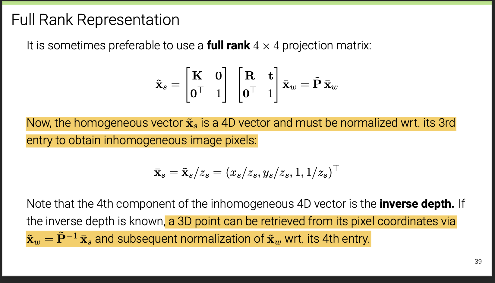
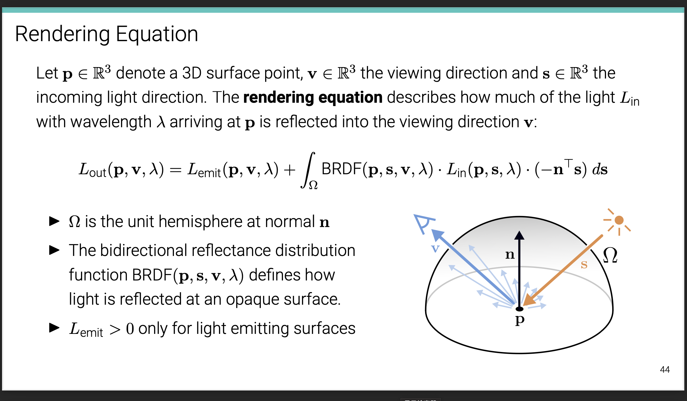

# Lec2 for ML-4360
## 2.1 Primitives & Transformations
### $Homogeneous$ 
* homogeneous coordinates & inhomogeneous coordinates
* argmented vector[one element out of the whole equivalent class],homogeneous vectors,homogeneous vectors
* points at infinity

* In homogeneous coordinates, the intersection of two lines is given by:
>$\tilde{x}$=$\tilde{l1}$ × $\tilde{l2}$ 

* the line joining two points can be compactly written as:
> $\tilde{l}$=$\tilde{x1}$ × $\tilde{x2}$ 

### $Transformations$
* translation 2DOF
* Euclidean 3DOF

* 正交矩阵$A^TA=I$

>$A^{-1}=A^T$

>$\left|A\right|$ = +-1

>A的行（列）向量组为n维单位正交向量组
* Similarity 4DOF
* Affine: 6DOF
>arbitrary $2×2$ matrix

> Parallels!
* Projective :8DOF——preserve straight lines
>> DOF（2D）:n(n-1)/2

>$\tilde{l}'$ = $(\tilde{H}^T)^{-1}$$\tilde{l}$
### Direct Linear Transform for Homography Estimation[algorithm DLT]
* UDV！
## 2.2 Geometric Image Formation
>Orthographic projection

>Perspective　projection

>lens distortion
* radial and tangential distortion
## 2.3 Photometric Image Formation
### $Rendering Equation$
* intensity :power per solid angle
>$dw=\sin\theta$$d\theta$$d\phi$
* Irradiance ： power per unit area
>E(x)=d$\Phi(x)$/dA
* Radiannce
>L(p,w)=$d^2\Phi(p,\omega)$/$d\omega$$dAcos\theta$

#### $BRDF$ "$Radiance_{out}/Irradiance_{in}$"
#### $The Reflection Equation$

### Back To Cameras

### $Chromatic Aberration$
## 2.4 Image Sensing Pipeline